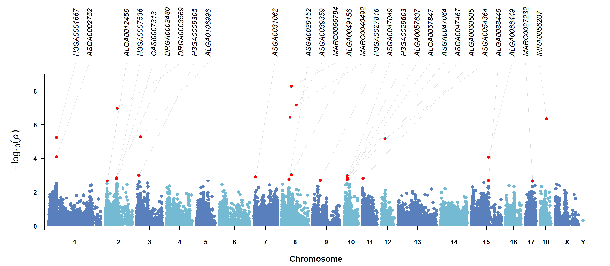
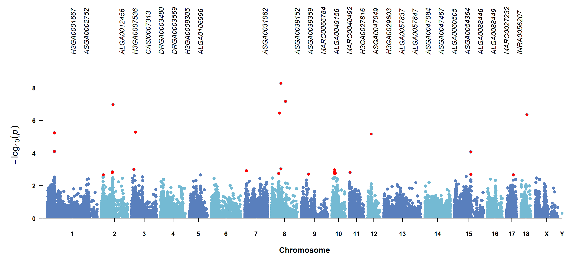
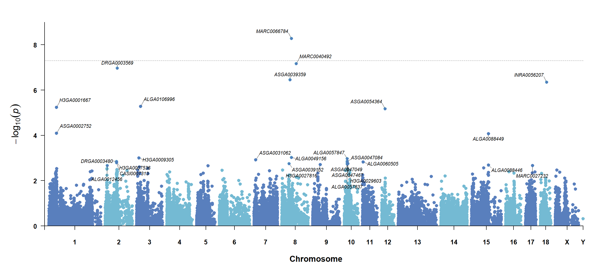
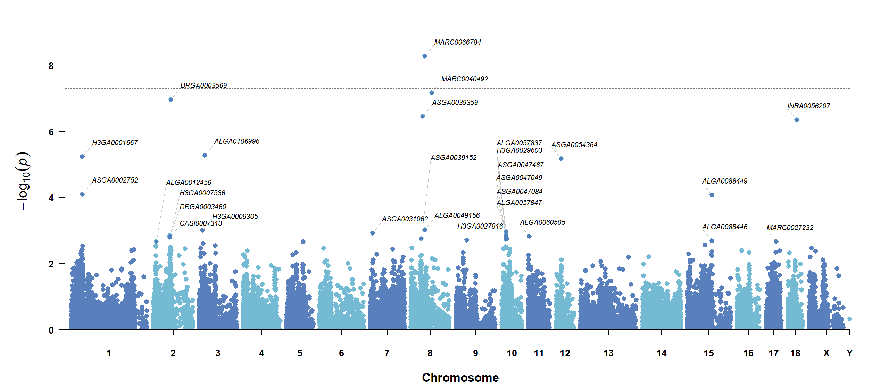
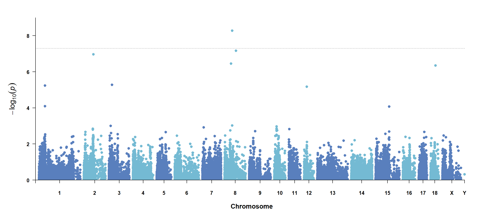
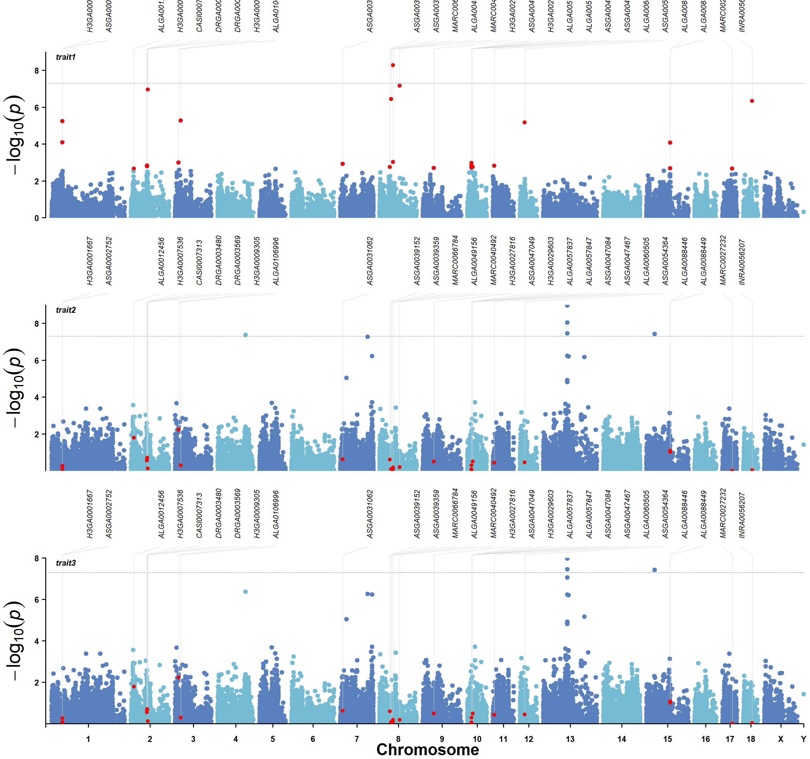

# CMplot-FastAnno
# CMplot-FastAnno

`CMplot-FastAnno` is a [CMplot](https://github.com/YinLiLin/CMplot) modified version focused on faster plotting and cleaner target SNP/gene annotation. Except for the new parameters and display defaults described here, other CMplot behavior is kept consistent with CMplot.

The bundled test folder is inside this modified version:

```text
CMplot-FastAnno/test
```

All examples below can be run from the `CMplot-FastAnno` directory.

## 1. What Changed

Main speed and plotting changes:

- Faster visible-point filtering, marker-density counting, chromosome coordinate offset calculation, and QQ confidence interval calculation.
- Rectangular Manhattan plots use chromosome numbers on the x-axis and `xlab = "Chromosome"` as the axis title.
- Scatter points start from the x-axis without the extra blank gap.
- Manhattan plots use `threshold = 5e-8` by default when `threshold` is omitted.
- Threshold-exceeding points keep the original point size unless `amplify = TRUE`.
- Annotated target points are red by default and keep the regular point size unless `highlight.col` or `highlight.cex` is changed.
- New top/nearby annotation modes support GWASLab-style label layouts with straight, elbow, automatic, or no connector lines.
- New `annotation.file` input lets users supply SNP/gene labels from a table.

Optimization and feature comments are marked directly in [R/CMplot.r](R/CMplot.r).

## 2. Main Input Data: `Pmap`

`CMplot()` expects `Pmap` to be an R `data.frame` or matrix-like object. If the data are stored as TSV, CSV, or gzipped text, read the file first and pass the resulting table to `CMplot()`.

Required column order:

| Column | Required | Meaning | Format |
| --- | --- | --- | --- |
| 1 | Yes | SNP/marker ID | character |
| 2 | Yes | Chromosome | integer, numeric, or chromosome label |
| 3 | Yes | Position | numeric base-pair position |
| 4+ | Yes | Trait p-values or scores | numeric; one column per trait |

Recommended column names:

```text
SNP	Chromosome	Position	trait1	trait2	trait3
MARC0066784	8	53910480	5.26e-09	4.97e-01	8.19e-01
MARC0040492	8	80539938	6.87e-08	7.14e-01	6.37e-01
```

Important rules:

- For raw p-values, use `LOG10 = TRUE`.
- If trait columns are already `-log10(P)`, use `LOG10 = FALSE`.
- Missing p-values can be `NA`; non-positive p-values are not valid with `LOG10 = TRUE`.
- Multi-trait and multi-track plots use all trait columns after `SNP`, `Chromosome`, and `Position`.

Bundled test data:

```r
pmap <- read.delim(
  gzfile("test/data/pig60K_example.tsv.gz"),
  stringsAsFactors = FALSE,
  check.names = FALSE
)
```

## 3. Annotation File Input

`annotation.file` can be a file path or an R `data.frame`. It is used when target SNP/gene labels should be controlled from an external table.

Required and optional columns:

| Column | Required | Meaning |
| --- | --- | --- |
| SNP | Yes | Marker ID; must match the first column of `Pmap` |
| Label | Yes | Text drawn on the plot |
| Trait | Optional | Trait column name in `Pmap`; use for trait-specific annotation |

Example annotation table:

```text
SNP	Label	Trait
MARC0066784	RDH10	trait1
MARC0040492	FAM172A	trait1
```

Column names can be customized:

```r
annotation.file = "test/data/pig60K_trait1_annotation_targets.tsv"
annotation.snp.col = "SNP"
annotation.label.col = "Label"
annotation.trait.col = "Trait"
```

Rules:

- If `Trait` is omitted or `annotation.trait.col = NULL`, matching SNPs are annotated wherever they appear.
- If `Trait` is provided, values must match trait column names in `Pmap`.
- TSV and CSV files are supported. Set `annotation.sep` if automatic delimiter detection is not enough.

## 4. Direct Highlight Input

Original CMplot-style `highlight` and `highlight.text` still work.

Single-trait input:

```r
highlight = c("MARC0066784", "MARC0040492")
highlight.text = c("RDH10", "FAM172A")
```

Multi-trait input:

```r
highlight = list(
  c("MARC0066784", "MARC0040492"),
  c("ASGA0039359")
)
highlight.text = list(
  c("RDH10", "FAM172A"),
  c("GENE2")
)
```

For direct input, marker IDs in `highlight` must match the first column of `Pmap`. Use a list when each trait needs a different target set.

## 5. New Annotation Parameters

```r
highlight.text.mode = c("scatter", "top", "nearby")
highlight.text.line.mode = c("auto", "straight", "elbow", "none")
highlight.text.side = c("auto", "left", "right", "alternate")
```

Main display controls:

| Parameter | Default | Meaning |
| --- | --- | --- |
| `highlight.text.mode` | `"scatter"` | legacy scatter labels, top labels, or nearby labels |
| `highlight.text.line.mode` | `"auto"` | connector style for labels |
| `highlight.text.side` | `"auto"` | preferred label displacement direction |
| `highlight.col` | `"red"` | annotated target point color |
| `highlight.cex` | `1` | annotated point size multiplier |
| `highlight.text.cex` | original CMplot value | annotation text size |
| `highlight.text.top.margin` | `8` | top margin reserved for top labels |
| `highlight.text.top.space` | `0.06` | vertical spacing between plot and top labels |

Annotated points are red by default:

```r
highlight.col = "red"
```

Custom colors can be a single color, a vector, or a per-trait list:

```r
highlight.col = "#4f7fbd"
highlight.col = c("#d62728", "#1f77b4")
highlight.col = list(c("#d62728", "#1f77b4"), c("#2ca02c"))
```

Annotated points keep regular point size by default:

```r
highlight.cex = 1
```

Use `highlight.cex` as a multiplier when target points should be larger or smaller.

## 6. Threshold Inputs

For Manhattan plots, if `threshold` is omitted, CMplot-FastAnno uses:

```r
threshold = 5e-8
```

User-defined thresholds keep the original CMplot input style:

```r
threshold = 5e-8
threshold = c(5e-8, 1e-6)
threshold = list(5e-8, c(5e-8, 1e-6))
```

To draw no threshold line:

```r
threshold = NULL
```

Threshold-hit point enlargement is off by default:

```r
amplify = FALSE
```

To restore CMplot-style enlarged threshold hits:

```r
amplify = TRUE
signal.cex = 1.5
```

## 7. Test Data And Scripts

Test data and scripts are under `CMplot_modify/test`.

| File | Purpose |
| --- | --- |
| `test/data/pig60K_example.tsv.gz` | Main `Pmap` input table |
| `test/data/pig60K_trait1_annotation_targets.tsv` | Annotation targets for `trait1` |
| `test/data/pig60K_trait1_top_snps.csv` | Selected top SNPs used by tests |
| `test/create_test_data.R` | Recreates bundled pig60K test inputs |
| `test/test_pig60k_annotation.R` | Generates annotation examples and result figures |
| `test/test_cmplot_fastanno_compatibility.R` | Runs smoke tests for existing CMplot functions |

Run from `CMplot_modify`:

```r
Rscript test/test_pig60k_annotation.R
Rscript test/test_cmplot_fastanno_compatibility.R
```

Latest bundled result folders:

```text
test/results/pig60K_annotation_20260424_230059
test/results/cmplot_fastanno_compatibility_20260424_230126
```

## 8. Basic Setup

```r
source("R/CMplot.r")

pmap <- read.delim(
  gzfile("test/data/pig60K_example.tsv.gz"),
  stringsAsFactors = FALSE,
  check.names = FALSE
)

trait_name <- "trait1"
threshold <- 5e-8
annotation_file <- "test/data/pig60K_trait1_annotation_targets.tsv"
```

## 9. Top Annotation From A File

This is the recommended mode for clean GWASLab-style target SNP/gene labels. Labels are placed above the plot and connected to their target points.

```r
CMplot(
  pmap[, c("SNP", "Chromosome", "Position", trait_name)],
  plot.type = "m",
  LOG10 = TRUE,
  threshold = threshold,
  annotation.file = annotation_file,
  annotation.snp.col = "SNP",
  annotation.label.col = "Label",
  annotation.trait.col = "Trait",
  highlight.text.mode = "top",
  highlight.text.line.mode = "auto",
  highlight.text.col = "black",
  highlight.text.cex = 0.9,
  file = "png",
  file.name = "pig60K_trait1_top_annotation"
)
```

Result:


What to notice:

- Annotated points are red by default.
- The x-axis shows chromosome numbers only.
- The x-axis title is placed below the tick labels without overlap.
- The point cloud starts from the x-axis without the previous lower gap.

## 10. Connector Line Modes

`highlight.text.line.mode` controls how top labels connect to target points.

### `highlight.text.line.mode = "auto"`

Automatically chooses straight or elbow-like connectors based on label/point alignment.

```r
CMplot(
  pmap[, c("SNP", "Chromosome", "Position", trait_name)],
  plot.type = "m",
  LOG10 = TRUE,
  threshold = threshold,
  annotation.file = annotation_file,
  annotation.snp.col = "SNP",
  annotation.label.col = "Label",
  annotation.trait.col = "Trait",
  highlight.text.mode = "top",
  highlight.text.line.mode = "auto",
  file = "png",
  file.name = "pig60K_trait1_line_auto"
)
```


### `highlight.text.line.mode = "straight"`

Draws direct straight connectors.

```r
CMplot(
  pmap[, c("SNP", "Chromosome", "Position", trait_name)],
  plot.type = "m",
  LOG10 = TRUE,
  threshold = threshold,
  annotation.file = annotation_file,
  annotation.snp.col = "SNP",
  annotation.label.col = "Label",
  annotation.trait.col = "Trait",
  highlight.text.mode = "top",
  highlight.text.line.mode = "straight",
  file = "png",
  file.name = "pig60K_trait1_line_straight"
)
```



### `highlight.text.line.mode = "elbow"`

Always uses the upper horizontal/diagonal arm plus vertical drop style.

```r
CMplot(
  pmap[, c("SNP", "Chromosome", "Position", trait_name)],
  plot.type = "m",
  LOG10 = TRUE,
  threshold = threshold,
  annotation.file = annotation_file,
  annotation.snp.col = "SNP",
  annotation.label.col = "Label",
  annotation.trait.col = "Trait",
  highlight.text.mode = "top",
  highlight.text.line.mode = "elbow",
  file = "png",
  file.name = "pig60K_trait1_line_elbow"
)
```


### `highlight.text.line.mode = "none"`

Draws labels and highlighted points without connector lines.

```r
CMplot(
  pmap[, c("SNP", "Chromosome", "Position", trait_name)],
  plot.type = "m",
  LOG10 = TRUE,
  threshold = threshold,
  annotation.file = annotation_file,
  annotation.snp.col = "SNP",
  annotation.label.col = "Label",
  annotation.trait.col = "Trait",
  highlight.text.mode = "top",
  highlight.text.line.mode = "none",
  file = "png",
  file.name = "pig60K_trait1_line_none"
)
```



## 11. Legacy Scatter Annotation

`highlight.text.mode = "scatter"` keeps the original CMplot-style label behavior.

```r
top_hits <- read.csv("test/data/pig60K_trait1_top_snps.csv", stringsAsFactors = FALSE)

CMplot(
  pmap[, c("SNP", "Chromosome", "Position", trait_name)],
  plot.type = "m",
  LOG10 = TRUE,
  threshold = threshold,
  highlight = top_hits$SNP,
  highlight.text = top_hits$SNP,
  highlight.text.mode = "scatter",
  highlight.col = "#4f7fbd",
  file = "png",
  file.name = "pig60K_trait1_scatter_annotation"
)
```

Result:



## 12. Nearby Annotation

`highlight.text.mode = "nearby"` places labels near the target points. This is useful when only a few targets need local labels.

```r
top_hits <- read.csv("test/data/pig60K_trait1_top_snps.csv", stringsAsFactors = FALSE)

CMplot(
  pmap[, c("SNP", "Chromosome", "Position", trait_name)],
  plot.type = "m",
  LOG10 = TRUE,
  threshold = threshold,
  highlight = top_hits$SNP,
  highlight.text = top_hits$SNP,
  highlight.text.mode = "nearby",
  highlight.text.side = "auto",
  highlight.text.line.mode = "auto",
  highlight.col = "#4f7fbd",
  file = "png",
  file.name = "pig60K_trait1_nearby_annotation"
)
```

Result:



## 13. Default Threshold And Default Point Size

When `threshold` is omitted in a Manhattan plot, `5e-8` is used automatically. Points above the threshold keep their original size unless `amplify = TRUE`.

```r
CMplot(
  pmap[, c("SNP", "Chromosome", "Position", trait_name)],
  plot.type = "m",
  LOG10 = TRUE,
  file = "png",
  file.name = "pig60K_trait1_threshold_default_size"
)
```

Result:



## 14. Multi-Track Annotation

Top annotation also works with `multracks = TRUE`. In multi-track plots, annotated points are red by default and keep the regular multi-track point size unless `highlight.col` or `highlight.cex` is changed.

```r
top_hits <- read.csv("test/data/pig60K_trait1_top_snps.csv", stringsAsFactors = FALSE)

CMplot(
  pmap,
  plot.type = "m",
  multracks = TRUE,
  LOG10 = TRUE,
  threshold = threshold,
  highlight = top_hits$SNP,
  highlight.text = top_hits$SNP,
  highlight.text.mode = "top",
  highlight.text.line.mode = "auto",
  highlight.col = "red",
  highlight.cex = 1,
  file = "png",
  file.name = "pig60K_multitrack_top_annotation"
)
```

Result:


