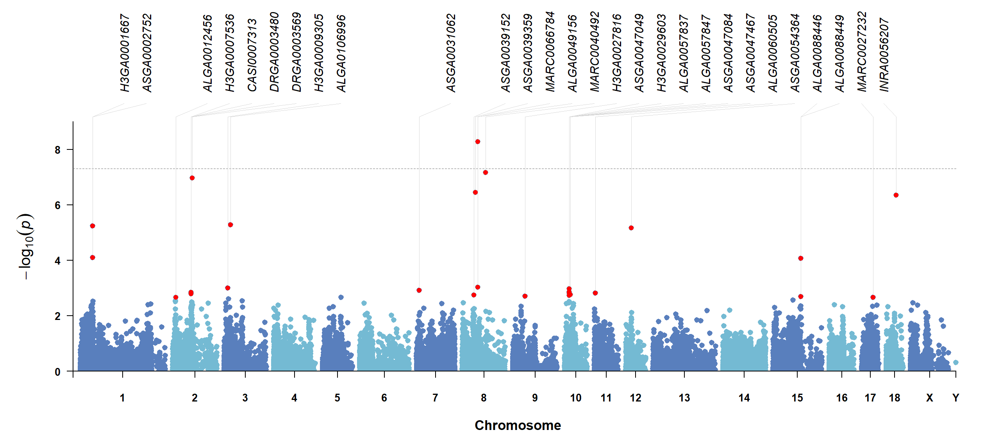
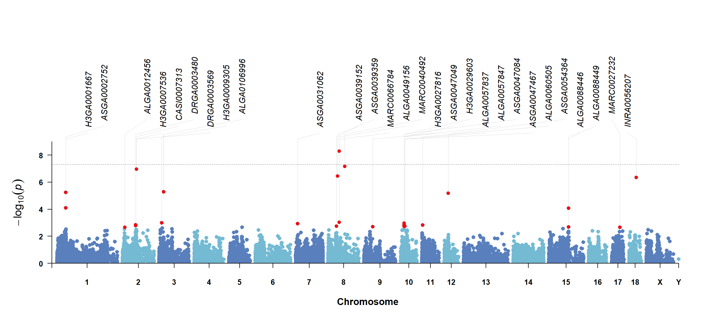

# CMplot-FastAnno

`CMplot-FastAnno` is a [CMplot](https://github.com/YinLiLin/CMplot) modified version focused on faster plotting and cleaner target SNP/gene annotation. Except for the new parameters and display defaults described here, other CMplot behavior is kept consistent with CMplot.

All examples below can be run from the `test` directory.

## 1. New Features

- Faster preprocessing and plotting for large GWAS-like tables.
- External annotation table input through `annotation.file`.
- Top annotation mode for clean SNP/gene labels above the plot.
- Stronger label collision avoidance for top labels.
- Multi-layer annotation lanes through `highlight.text.lanes`.
- Connector styles through `highlight.text.line.mode = "auto"`, `"straight"`, `"elbow"`, or `"none"`.
- Nearby annotation mode for local labels beside target points.
- Annotated points default to red and keep the normal point size.
- Manhattan plots use `5e-8` as the default threshold when `threshold` is omitted.
- Threshold-exceeding points are not enlarged unless `amplify = TRUE`.
- Rectangular Manhattan x-axis shows chromosome numbers only, with `Chromosome` as the axis title.

Feature and optimization comments are marked directly in [R/CMplot.r](R/CMplot.r).

## 2. Main GWAS Data Format

The main data table follows the original CMplot layout. It should contain only marker coordinates and trait values. Annotation labels should be supplied in a separate annotation file.

Required column order:

| Column | Required | Meaning | Format |
| --- | --- | --- | --- |
| 1 | Yes | SNP/marker ID | character |
| 2 | Yes | Chromosome | integer, numeric, or chromosome label |
| 3 | Yes | Position | numeric base-pair position |
| 4+ | Yes | Trait p-values or scores | numeric; one column per trait |

Example:

```text
SNP	Chromosome	Position	trait1	trait2	trait3
MARC0066784	8	53910480	5.26e-09	4.97e-01	8.19e-01
MARC0040492	8	80539938	6.87e-08	7.14e-01	6.37e-01
```

Read the bundled test data:

```r
gwas_data <- read.delim(
  gzfile("test/data/pig60K_example.tsv.gz"),
  stringsAsFactors = FALSE,
  check.names = FALSE
)
```

Rules:

- Use `LOG10 = TRUE` for raw p-values.
- Use `LOG10 = FALSE` when trait columns are already `-log10(P)`.
- Missing p-values can be `NA`.
- With `LOG10 = TRUE`, p-values must be positive.
- Multi-trait and multi-track plots use all trait columns after `SNP`, `Chromosome`, and `Position`.

## 3. Annotation File Format

The annotation file is independent from the main GWAS data table.

Required and optional columns:

| Column | Required | Meaning |
| --- | --- | --- |
| SNP | Yes | Marker ID matching the first column of the main GWAS table |
| Label | Yes | Text drawn on the plot, such as SNP ID or gene name |
| Trait | Optional | Trait column name; use it for trait-specific annotation |

Example:

```text
SNP	Label	Trait
MARC0066784	RDH10	trait1
MARC0040492	FAM172A	trait1
```

Use custom column names when needed:

```r
annotation.file = "test/data/pig60K_trait1_annotation_targets.tsv"
annotation.snp.col = "SNP"
annotation.label.col = "Label"
annotation.trait.col = "Trait"
```

Rules:

- If `Trait` is omitted, matching SNPs are annotated wherever they appear.
- If `Trait` is provided, values must match trait column names in the main GWAS table.
- TSV and CSV files are supported.
- Use `annotation.sep` if delimiter detection is not enough.

## 4. New Annotation Parameters

```r
highlight.text.mode = c("scatter", "top", "nearby")
highlight.text.line.mode = c("auto", "straight", "elbow", "none")
highlight.text.side = c("auto", "left", "right", "alternate")

highlight.text.optimize = TRUE
highlight.text.lanes = 1
highlight.text.lane.gap = 0.055
highlight.text.min.gap = 0.004
```

Important controls:

| Parameter | Default | Meaning |
| --- | --- | --- |
| `highlight.text.mode` | `"scatter"` | legacy scatter labels, top labels, or nearby labels |
| `highlight.text.line.mode` | `"auto"` | connector style for top/nearby labels |
| `highlight.text.optimize` | `TRUE` | reduce top-label collisions and connector clutter |
| `highlight.text.lanes` | `1` | number of top annotation label lanes |
| `highlight.text.lane.gap` | `0.055` | vertical spacing between annotation lanes |
| `highlight.text.min.gap` | `0.004` | minimum x-axis spacing between top labels |
| `highlight.col` | `"red"` | annotated target point color |
| `highlight.cex` | `1` | annotated point size multiplier |
| `highlight.text.top.margin` | `8` | top margin reserved for top labels |

Annotated points default to red:

```r
highlight.col = "red"
```

Annotated points keep regular point size:

```r
highlight.cex = 1
```

Use `highlight.cex` as a multiplier when annotated points should be larger or smaller.

## 5. Threshold Behavior

If `threshold` is omitted for Manhattan plots, CMplot-FastAnno uses:

```r
threshold = 5e-8
```

User-defined thresholds keep the original CMplot style:

```r
threshold = 5e-8
threshold = c(5e-8, 1e-6)
threshold = list(5e-8, c(5e-8, 1e-6))
```

Draw no threshold line:

```r
threshold = NULL
```

Threshold-hit point enlargement is off by default:

```r
amplify = FALSE
```

Restore enlarged threshold hits:

```r
amplify = TRUE
signal.cex = 1.5
```

## 6. Test Folder

Files:

| File | Purpose |
| --- | --- |
| `test/data/pig60K_example.tsv.gz` | Main GWAS test table |
| `test/data/pig60K_trait1_annotation_targets.tsv` | Separate annotation file |
| `test/data/pig60K_trait1_top_snps.csv` | Selected top SNPs for examples |
| `test/create_test_data.R` | Recreate test input files |
| `test/test_pig60k_annotation.R` | Generate new-feature example figures |

All generated result files are written directly into:

```text
test/results
```

No subfolders are created inside `test/results`.

Run:

```r
Rscript test/test_pig60k_annotation.R
```

## 7. Basic Setup For Examples

```r
source("R/CMplot.r")

gwas_data <- read.delim(
  gzfile("test/data/pig60K_example.tsv.gz"),
  stringsAsFactors = FALSE,
  check.names = FALSE
)

trait_name <- "trait1"
annotation_file <- "test/data/pig60K_trait1_annotation_targets.tsv"
threshold <- 5e-8
```

## 8. Top Annotation From Separate File

This mode reads target SNP labels from `annotation.file`, places labels above the plot, and connects them to target points.

```r
CMplot(
  gwas_data[, c("SNP", "Chromosome", "Position", trait_name)],
  plot.type = "m",
  LOG10 = TRUE,
  threshold = threshold,
  annotation.file = annotation_file,
  annotation.snp.col = "SNP",
  annotation.label.col = "Label",
  annotation.trait.col = "Trait",
  highlight.text.mode = "top",
  highlight.text.line.mode = "auto",
  highlight.text.optimize = TRUE,
  file = "png",
  file.name = "pig60K_trait1_top_annotation"
)
```

Result:



## 9. Stronger Collision Avoidance

`highlight.text.optimize = TRUE` globally spaces top labels along the x-axis before drawing connectors. This reduces label overlap and keeps connectors more orderly.

```r
CMplot(
  gwas_data[, c("SNP", "Chromosome", "Position", trait_name)],
  plot.type = "m",
  LOG10 = TRUE,
  threshold = threshold,
  annotation.file = annotation_file,
  annotation.snp.col = "SNP",
  annotation.label.col = "Label",
  annotation.trait.col = "Trait",
  highlight.text.mode = "top",
  highlight.text.optimize = TRUE,
  highlight.text.min.gap = 0.006,
  highlight.text.line.mode = "auto",
  file = "png",
  file.name = "pig60K_trait1_top_annotation"
)
```

Result:


## 10. Multi-Layer Annotation Lanes

Use `highlight.text.lanes` when many labels compete for the same top region. Labels are first collision-avoided on the x-axis, then distributed across lanes.

```r
CMplot(
  gwas_data[, c("SNP", "Chromosome", "Position", trait_name)],
  plot.type = "m",
  LOG10 = TRUE,
  threshold = threshold,
  annotation.file = annotation_file,
  annotation.snp.col = "SNP",
  annotation.label.col = "Label",
  annotation.trait.col = "Trait",
  highlight.text.mode = "top",
  highlight.text.optimize = TRUE,
  highlight.text.lanes = 3,
  highlight.text.lane.gap = 0.055,
  highlight.text.min.gap = 0.006,
  highlight.text.line.mode = "auto",
  highlight.text.top.margin = 12,
  file = "png",
  file.name = "pig60K_trait1_lanes3_annotation"
)
```

Result:



## 11. Connector Line Modes

`highlight.text.line.mode` controls how top labels connect to target points.

### `auto`

Uses a straight connector when the label is nearly aligned with the point; otherwise uses an elbow-style connector.

```r
highlight.text.line.mode = "auto"
```


### `straight`

Draws direct straight connectors.

```r
highlight.text.line.mode = "straight"
```


### `elbow`

Always uses the upper arm plus vertical drop style.

```r
highlight.text.line.mode = "elbow"
```


### `none`

Draws labels and target points without connector lines.

```r
highlight.text.line.mode = "none"
```


## 12. Nearby Annotation

Nearby mode places labels beside target points instead of above the whole plot.

```r
top_hits <- read.csv("test/data/pig60K_trait1_top_snps.csv", stringsAsFactors = FALSE)

CMplot(
  gwas_data[, c("SNP", "Chromosome", "Position", trait_name)],
  plot.type = "m",
  LOG10 = TRUE,
  threshold = threshold,
  highlight = top_hits$SNP,
  highlight.text = top_hits$SNP,
  highlight.text.mode = "nearby",
  highlight.text.side = "auto",
  highlight.text.line.mode = "auto",
  file = "png",
  file.name = "pig60K_trait1_nearby_annotation"
)
```

Result:


## 13. Default Threshold And Default Point Size

This example omits `threshold`. CMplot-FastAnno draws the default `5e-8` line, and threshold-exceeding points keep their normal size because `amplify = FALSE`.

```r
CMplot(
  gwas_data[, c("SNP", "Chromosome", "Position", trait_name)],
  plot.type = "m",
  LOG10 = TRUE,
  file = "png",
  file.name = "pig60K_trait1_threshold_default_size"
)
```

Result:


## 14. Multi-Track Annotation

Top annotation also works with `multracks = TRUE`. Annotated points remain red and keep normal point size by default.

```r
top_hits <- read.csv("test/data/pig60K_trait1_top_snps.csv", stringsAsFactors = FALSE)

CMplot(
  gwas_data,
  plot.type = "m",
  multracks = TRUE,
  LOG10 = TRUE,
  threshold = threshold,
  highlight = top_hits$SNP,
  highlight.text = top_hits$SNP,
  highlight.text.mode = "top",
  highlight.text.line.mode = "auto",
  highlight.text.optimize = TRUE,
  highlight.col = "red",
  highlight.cex = 1,
  file = "png",
  file.name = "pig60K_multitrack_top_annotation"
)
```

Result:


