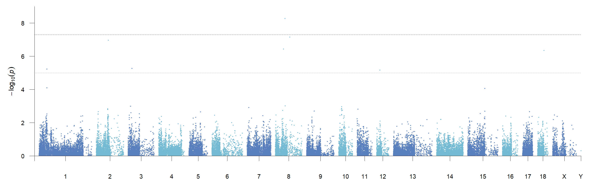
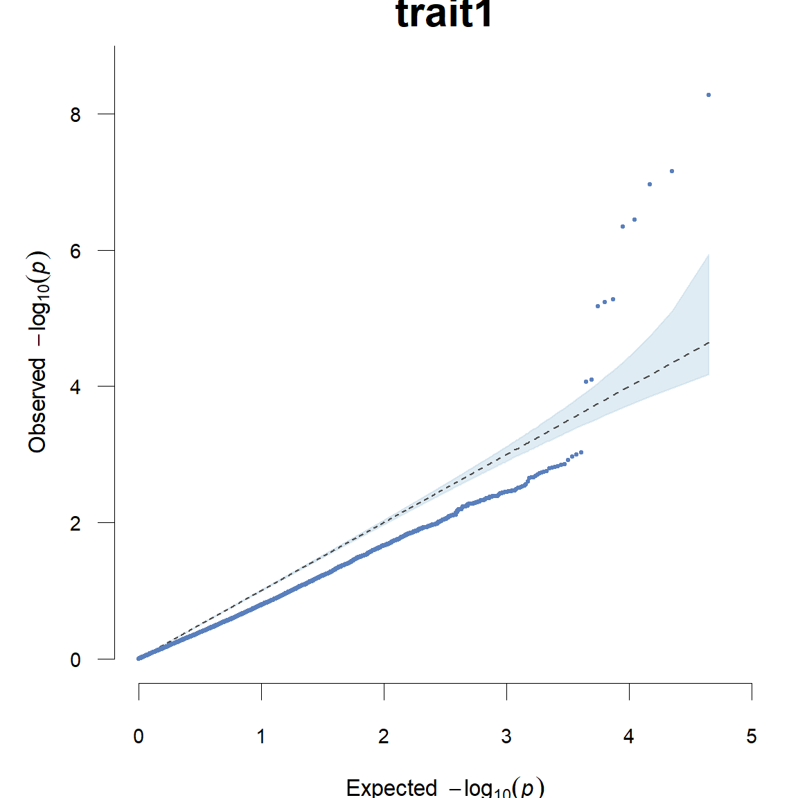
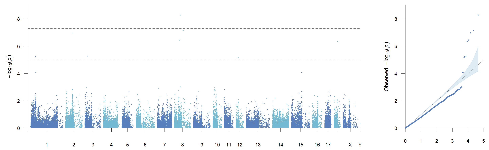
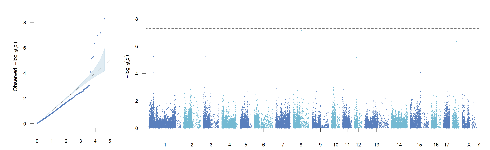
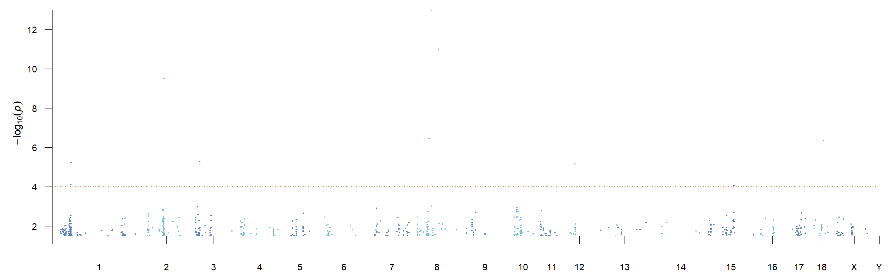
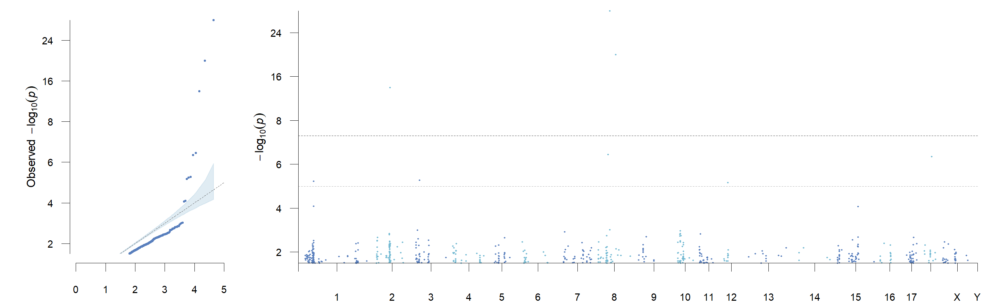
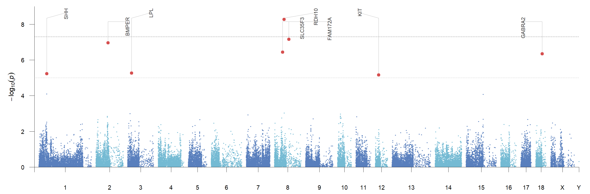
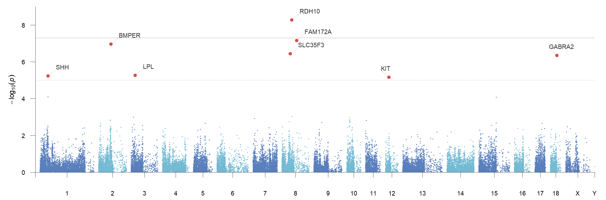
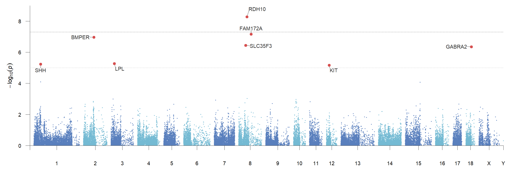
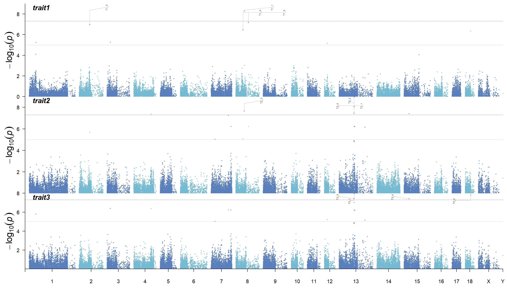

# CMplot-FastAnno

`CMplot-FastAnno` is a [CMplot](https://github.com/YinLiLin/CMplot) modified version focused on faster plotting and cleaner target SNP/gene annotation. Except for the new parameters and display defaults described here, other CMplot behavior is kept consistent with CMplot.

The package uses only base R packages: `graphics`, `grDevices`, `stats`, and `utils`.

## 1. New Features

- Faster preprocessing and plotting for large GWAS-like tables.
- External annotation table input through `annotation.file`.
- Top annotation mode for clean SNP/gene labels above the plot.
- Stronger label collision avoidance for top labels.
- Multi-layer annotation lanes through `highlight.text.lanes`.
- Connector styles through `highlight.text.line.mode = "auto"`, `"straight"`, `"elbow"`, or `"none"`.
- Nearby annotation mode for local labels beside target points.
- Annotated points default to red and keep the normal point size.
- Manhattan plots use `5e-8` as the default threshold when `threshold` is omitted.
- Threshold-exceeding points are not enlarged unless `amplify = TRUE`.
- Rectangular Manhattan x-axis shows chromosome numbers only, with `Chromosome` as the axis title.

Feature and optimization comments are marked directly in [R/CMplot.r](R/CMplot.r).

## 2. Main GWAS Data Format

The main data table follows the original CMplot layout. It should contain only marker coordinates and trait values. Annotation labels should be supplied in a separate annotation file.

Required column order:

| Column | Required | Meaning | Format |
| --- | --- | --- | --- |
| 1 | Yes | SNP/marker ID | character |
| 2 | Yes | Chromosome | integer, numeric, or chromosome label |
| 3 | Yes | Position | numeric base-pair position |
| 4+ | Yes | Trait p-values or scores | numeric; one column per trait |

Example:

```text
SNP	Chromosome	Position	trait1	trait2	trait3
MARC0066784	8	53910480	5.26e-09	4.97e-01	8.19e-01
MARC0040492	8	80539938	6.87e-08	7.14e-01	6.37e-01
```

Read the bundled test data:

```r
gwas_data <- read.delim(
  gzfile("test/data/pig60K_example.tsv.gz"),
  stringsAsFactors = FALSE,
  check.names = FALSE
)
```

Rules:

- Use `LOG10 = TRUE` for raw p-values.
- Use `LOG10 = FALSE` when trait columns are already `-log10(P)`.
- Missing p-values can be `NA`.
- With `LOG10 = TRUE`, p-values must be positive.
- Multi-trait and multi-track plots use all trait columns after `SNP`, `Chromosome`, and `Position`.

## 3. Annotation File Format

The annotation file is independent from the main GWAS data table.

Required and optional columns:

| Column | Required | Meaning |
| --- | --- | --- |
| SNP | Yes | Marker ID matching the first column of the main GWAS table |
| Label | Yes | Text drawn on the plot, such as SNP ID or gene name |
| Trait | Optional | Trait column name; use it for trait-specific annotation |

Example:

```text
SNP	Label	Trait
MARC0066784	RDH10	trait1
MARC0040492	FAM172A	trait1
```

Use custom column names when needed:

```r
annotation.file = "test/data/pig60K_trait1_annotation_targets.tsv"
annotation.snp.col = "SNP"
annotation.label.col = "Label"
annotation.trait.col = "Trait"
```

Rules:

- If `Trait` is omitted, matching SNPs are annotated wherever they appear.
- If `Trait` is provided, values must match trait column names in the main GWAS table.
- TSV and CSV files are supported.
- Use `annotation.sep` if delimiter detection is not enough.

## Example 1: Rectangular Manhattan

The default rectangular Manhattan plot keeps chromosome-only x-axis labels and
draws clean genome-wide and suggestive guide lines.

```r
run_plot(list(
  Pmap = trait1_data,
  plot.type = "m",
  LOG10 = TRUE,
  sig.line = TRUE,
  suggestive.line = TRUE,
  file = "png",
  file.name = "readme_01_rectangular_manhattan",
  width = 11.8,
  height = 3.65,
  dpi = 240,
  verbose = FALSE
))
```



## Example 2: Q-Q Plot

The Q-Q plot keeps the CMplot interface while using the optimized confidence
interval calculation.

```r
run_plot(list(
  Pmap = trait1_data,
  plot.type = "q",
  LOG10 = TRUE,
  threshold.col = "#4D4D4D",
  threshold.lwd = 0.9,
  conf.int.col = "#A9C9DF",
  file = "png",
  file.name = "readme_02_qq",
  width = 4.8,
  height = 4.8,
  dpi = 240,
  verbose = FALSE
))
```



## Example 3: Combined Manhattan Plus Q-Q

`plot.type = "mqq"` creates a Manhattan panel and a Q-Q panel in one output
file. Use `mqqratio` to control the relative panel widths.

```r
run_plot(list(
  Pmap = trait1_data,
  plot.type = "mqq",
  LOG10 = TRUE,
  sig.line = TRUE,
  suggestive.line = TRUE,
  mqqratio = c(3.15, 1),
  conf.int.col = "#A9C9DF",
  file = "png",
  file.name = "readme_05_mqq",
  width = 12.0,
  height = 3.7,
  dpi = 240,
  verbose = FALSE
))
```



## Example 4: Combined Q-Q Plus Manhattan

`plot.type = "qqm"` reverses the panel order while keeping the same styling and
threshold controls.

```r
run_plot(list(
  Pmap = trait1_data,
  plot.type = "qqm",
  LOG10 = TRUE,
  sig.line = TRUE,
  suggestive.line = TRUE,
  mqqratio = c(1, 3.15),
  conf.int.col = "#A9C9DF",
  file = "png",
  file.name = "readme_06_qqm",
  width = 12.0,
  height = 3.7,
  dpi = 240,
  verbose = FALSE
))
```



## Example 5: Already-Scaled Input With Skip And Cut

Use `scaled = TRUE` when the trait column is already `-log10(P)`. Threshold
arguments such as `sig.level`, `suggestive.level`, `additional.line`, and
`threshold` still remain on the p-value scale when `LOG10 = TRUE`.

```r
run_plot(list(
  Pmap = scaled_data,
  plot.type = "m",
  scaled = TRUE,
  sig.line = TRUE,
  suggestive.line = TRUE,
  additional.line = 1e-4,
  additional.line.col = "#C58F62",
  additional.line.lty = 3,
  skip = 1.5,
  cut = 8,
  cutfactor = 4,
  file = "png",
  file.name = "readme_07_scaled_skip_cut",
  width = 11.8,
  height = 3.65,
  dpi = 240,
  verbose = FALSE
))
```



## Example 6: Combined Plot With Compressed Extreme Values

`skip`, `cut`, and `cutfactor` transform display coordinates only. The original
values are still used for matching highlights, labels, and significance rules.

```r
run_plot(list(
  Pmap = scaled_data,
  plot.type = "qqm",
  scaled = TRUE,
  skip = 1.5,
  cut = 8,
  cutfactor = 4,
  sig.line = TRUE,
  suggestive.line = TRUE,
  mqqratio = c(1, 3.15),
  conf.int.col = "#A9C9DF",
  file = "png",
  file.name = "readme_08_qqm_scaled",
  width = 12.0,
  height = 3.7,
  dpi = 240,
  verbose = FALSE
))
```



## Example 7: Annotation Table With Top Labels

Annotations can be supplied as a data frame or as a CSV/TSV file. Use
`annotation.snp.col`, `annotation.label.col`, and `annotation.trait.col` when
the column names need to be explicit.

```r
run_plot(list(
  Pmap = trait1_data,
  plot.type = "m",
  LOG10 = TRUE,
  annotation.file = annotation_targets[1:8, ],
  annotation.snp.col = "SNP",
  annotation.label.col = "Gene",
  annotation.trait.col = "Trait",
  highlight.text.mode = "top",
  highlight.text.line.mode = "auto",
  highlight.text.optimize = TRUE,
  highlight.text.lanes = 2,
  highlight.text.top.inside = TRUE,
  highlight.text.top.margin = 6,
  sig.line = TRUE,
  suggestive.line = TRUE,
  file = "png",
  file.name = "readme_10_annotation_table_top",
  width = 11.8,
  height = 3.9,
  dpi = 240,
  verbose = FALSE
))
```



## Example 8: Nearby Labels

Nearby labels place text beside target points. `highlight.text.side = "auto"`
chooses the side from the target position.

```r
run_plot(list(
  Pmap = trait1_data,
  plot.type = "m",
  LOG10 = TRUE,
  highlight = annotation_targets$SNP[1:8],
  highlight.text = annotation_targets$Gene[1:8],
  highlight.text.mode = "nearby",
  highlight.text.side = "auto",
  highlight.text.line.mode = "elbow",
  highlight.text.nearby.offset = 0.014,
  sig.line = TRUE,
  suggestive.line = TRUE,
  file = "png",
  file.name = "readme_11_nearby_labels",
  width = 11.8,
  height = 3.9,
  dpi = 240,
  verbose = FALSE
))
```



## Example 9: Scatter Labels

The legacy CMplot scatter-label mode is still available for compatibility.

```r
run_plot(list(
  Pmap = trait1_data,
  plot.type = "m",
  LOG10 = TRUE,
  highlight = annotation_targets$SNP[1:8],
  highlight.text = annotation_targets$Gene[1:8],
  highlight.text.mode = "scatter",
  sig.line = TRUE,
  suggestive.line = TRUE,
  file = "png",
  file.name = "readme_12_scatter_labels",
  width = 11.8,
  height = 3.9,
  dpi = 240,
  verbose = FALSE
))
```



## Example 10: Multi-Track Top Annotation

For multi-trait plots, pass `highlight` and `highlight.text` as lists with one
element per trait.

```r
run_plot(list(
  Pmap = multi_data,
  plot.type = "m",
  multracks = TRUE,
  LOG10 = TRUE,
  highlight = highlight_by_trait,
  highlight.text = highlight_text_by_trait,
  highlight.text.mode = "top",
  highlight.text.line.mode = "auto",
  highlight.text.optimize = TRUE,
  highlight.text.lanes = 2,
  highlight.text.top.inside = TRUE,
  highlight.text.cex = 0.54,
  highlight.text.top.cex = 0.66,
  sig.line = TRUE,
  suggestive.line = TRUE,
  width = 11.8,
  height = 2.25,
  dpi = 240,
  file = "png",
  file.name = "readme_13_multitrack_top_annotation",
  verbose = FALSE
))
```



## Example 11: Q-Q Diagonal Line Width

The Q-Q reference diagonal correctly uses `threshold.lwd`, so line width can be
controlled the same way as other threshold guides.

```r
run_plot(list(
  Pmap = trait1_data,
  plot.type = "q",
  LOG10 = TRUE,
  threshold.col = "#333333",
  threshold.lwd = 2.8,
  threshold.lty = 2,
  conf.int.col = "#A9C9DF",
  file = "png",
  file.name = "readme_14_qq_diagonal_lwd",
  width = 4.8,
  height = 4.8,
  dpi = 240,
  verbose = FALSE
))
```
